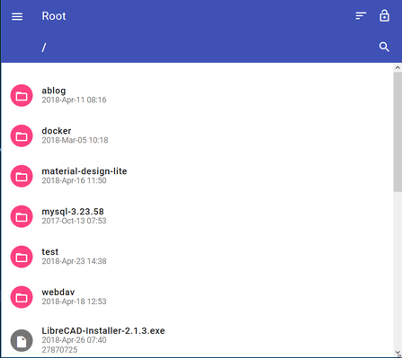
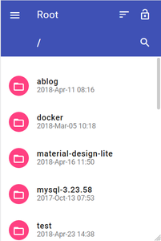

# Nginx-Fancyindex-Theme

Theme "design material" for nginx-fancyindex module






## Installation

The fancyindex module can be found [here](https://github.com/aperezdc/ngx-fancyindex) (by @aperezdc).

On debian

    apt-get install git nginx-extras

sample of configuration of nginx

```bash
server {
    listen 80 default_server;
    client_max_body_size 1G;
    
    location / {
        root /<path_nginx_root>;
        fancyindex on;
        fancyindex_localtime on;
        fancyindex_name_length 255; # Maximum file name length in bytes, change as you like.
        # theme
        fancyindex_header "/fancyindex/header.html";
        fancyindex_footer "/fancyindex/footer.html";
        fancyindex_ignore "fancyindex";

        auth_basic  "Access restricted";
        auth_basic_user_file /etc/nginx/.htpasswd;
    }

}
```

you can clone project an copy file in your root path nginx

    git clone https://github.com/fraoustin/Nginx-Fancyindex-Theme.git
    mkdir /<path_nginx_root>/fancyindex
    cd Nginx-Fancyindex-Theme
    cp -R * /<path_nginx_root>/fancyindex

you can change color of interface

    cd /<path_nginx_root>/fancyindex/mdl
    rm material.min.css 
    cp color/<your-color>.min.css material.min.css


## TODO


reste test global, search, déconnexion, ...

voir pour faire la même chose sur gitweb? avoir si cela est possible

pour webdav il faudra ajouter uplod et delete element
voir intégration font et icone

